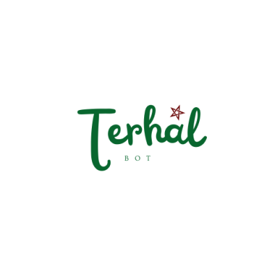

# Terhal 🗺️⁀જ✈︎ 🇲🇦

<div align="center">
    
</div>

##  Background and Problem Statement: 💢

Salma and Zineb are planning to visit 5 Moroccan cities during their 1-week vacation ⏳, but the real challenge is the planning process. They’ve learned that **for every week of travel**, they need **3 weeks of planing**, from **finding the best spots to visit to understanding transportation options** ˚˖𓍢ִ໋🍃˚.⛰️⋆☁️. Yet, they only speak **DARIJA**, which makes it hard for them to search in foreign languages. They tried **consulting a guide**, but it was **5 times more expensive than expected** and felt too **general**. This issue is holding them back 😟, and it’s affecting Morocco’s **tourism sector** 📉, which **contributes 7% of GDP**. 

Do we really need weeks of prep for just 1 week of travel? And do we need to speak foreign languages to travel in our own country ⁉️


##  Impact and Proposed Solution: 💡

**Terhal** is an AI Assistant that understands **DARIJA** perfectly, and who is **knowledgeable about the best spots** to visit in each city in Morocco. It can help Zineb, Salma and their fellows **plan their trips in 10 minutes instead of 3 weeks**, while providing them with **personalized recommendations**. 

##  Project Outcomes and Deliverables:

##  Instructions:

The repository is organised following this layout:

```markdown

BUILDERS ALLIANCE/
├── code/
│   ├── ai_api_and_deployment/
│   │   ├── app/
│   │   ├── dataset/
│   │   ├── model/
│   │   ├── __init__.py
│   │   ├── main.py
│   │   ├── Dockerfile
│   │   ├── .env
│   │   └── requirements.txt
│   └── webApp/
│       ├── chat.html
│       ├── script.js
│       ├── styles.css
│       ├── requirements
│       └── package.json
|
├── presentation.pdf
├── demo
├── Terhal Logo
├── requirements.txt
├── .gitignore
└── README.md

```

### Prerequisites

Before starting, ensure you have the following installed:
- **Python** (3.9 or later)
- **Node.js** (16.x or later) and **npm**
- **Docker** (optional, for containerized deployment)
- An internet connection to access the deployed AI API hosted on [Render](https://render.com) (free hosting).

---

### Installation and Setup

#### Clone the Repository

To begin, clone this repository to your local machine and navigate to the project folder:

```bash
git clone https://github.com/salmaelbarbori/2024-InnovAI-Hackathon/tree/main/BUILDERS%20ALLIANCE
cd 2024-InnovAI-Hackathon/BUILDERS%20ALLIANCE
```

#### Navigate to the **ai_api_and_deployment** folder:

```bash
cd builders/code/ai_api_and_deployment
```

Install the Python dependencies:

```bash
pip install -r requirements.txt
```

uvicorn main:app --reload

```bash
uvicorn main:app --reload
```

#### Navigate to the **webApp** folder:

```bash
cd ../webApp
```

Install npm dependencies:

```bash
npm install
```

Start the web application:

```bash
node proxy-server.js
```

#### Run the Application

Install Python dependencies from the main requirements.txt:

```bash
Install Python dependencies from the main requirements.txt:
```

Navigate to the webApp folder and install npm dependencies:
bash

 ```bash
 cd builders/code/webApp
npm install
node proxy-server.js
 ```

 ## Pitch 

 ## Demo
